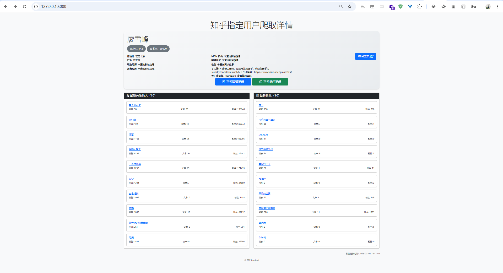
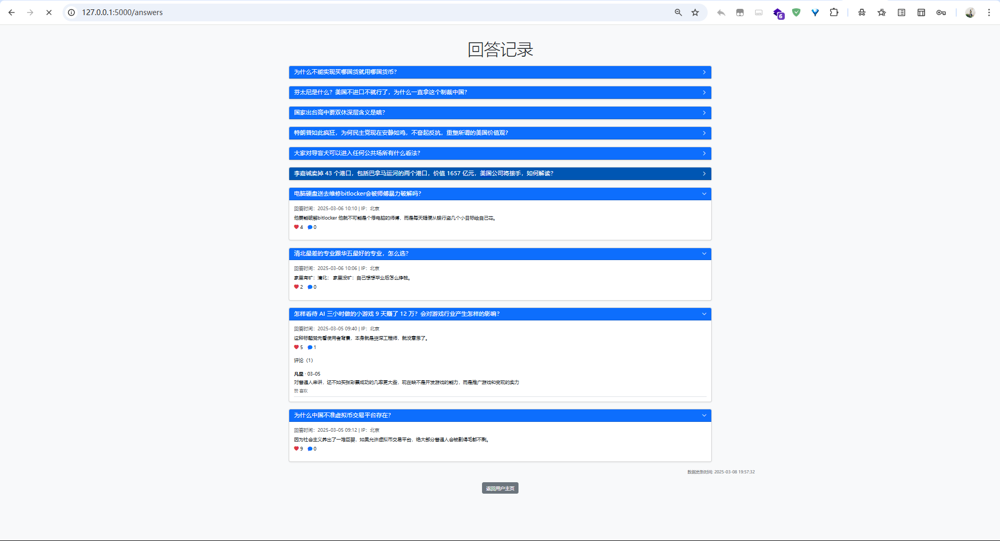
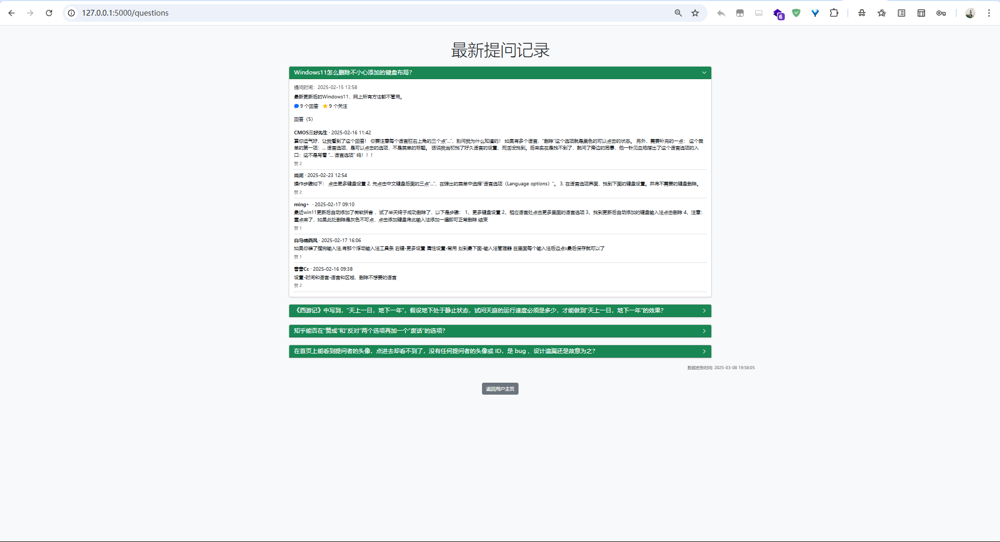

# ContentSecurityLab

## 1.crawler_zhihu

知乎重点人物数据采集及反爬：

（1） 基本属性信息：用户名、性别、一句话介绍、居住地、所在行业、职业经历、个人简介

（2） 社交关系信息：所有关注人和粉丝（如果关注人数量或者粉丝数量超过10，则只采集前10个），每个人的信息包括用户昵称、链接地址、回答问题数、文章数、关注者人数。

（3） 动态信息：所有回答和提问（如果回答和提问的总量超过10，则只采集前10条），每个回答或评论的信息包括发帖时间、发帖内容、评论次数、点赞次数、前10条评论（评论人ID、评论人昵称、评论时间、评论内容、点赞次数）。当用户更新了回答或提问后，应在1分钟内监控到该变化，并及时更新本地信息。

（4） 反爬功能实现：任意编写一个简单网站，复现一种基于行为监测的反爬机制，规定：若用户在规定时间窗口内没有鼠标移动、拖拽、点击等事件，则弹出消息提醒用户

实现：根据name进行知乎搜索，获取用户界面位置第一的用户，获取其基本信息，并对其回答和提问进行动态监控，以守护进程的方式每一分钟更新一次，使用flask渲染前端

前端展示：

